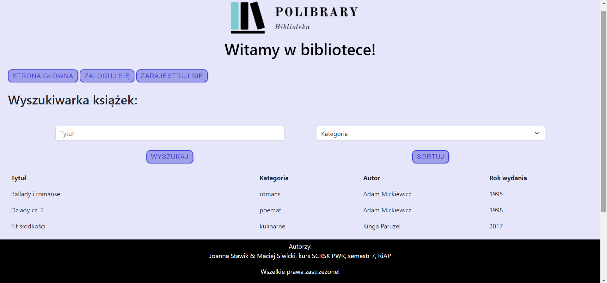
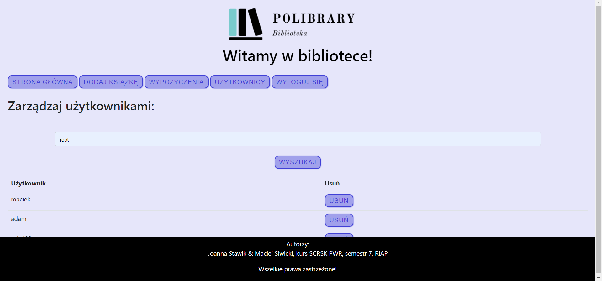
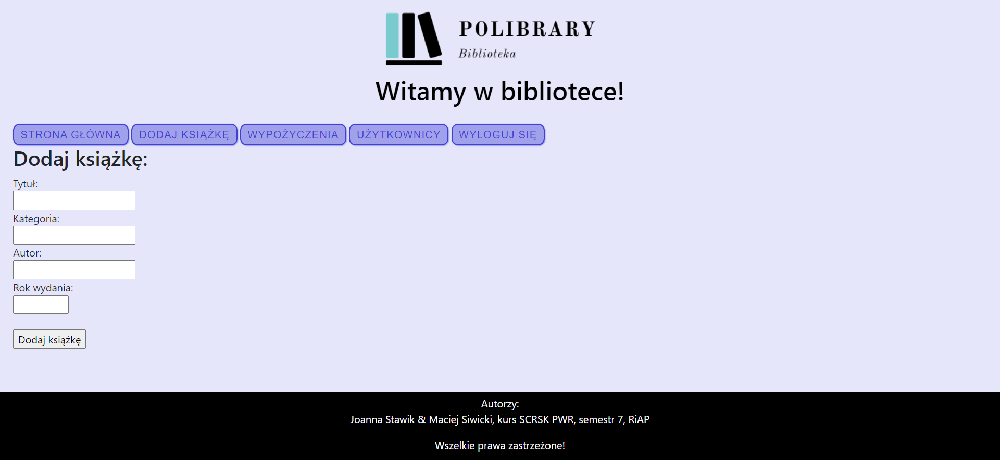
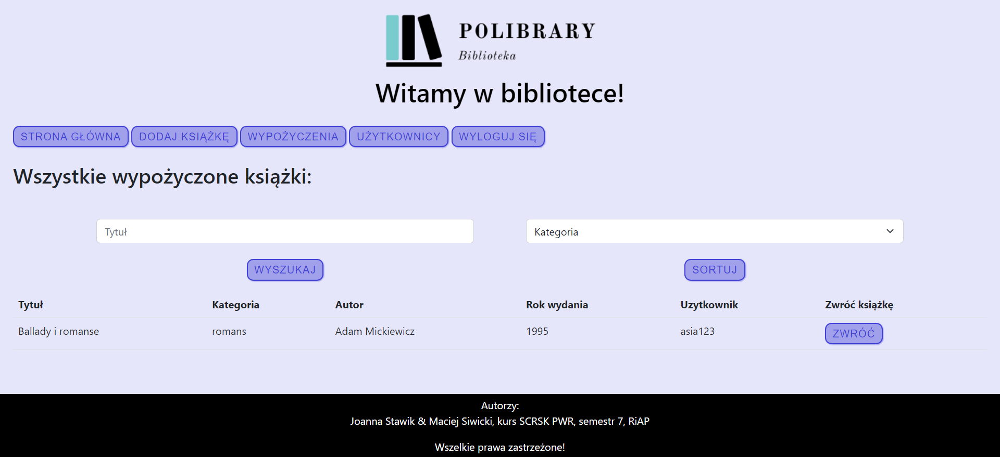
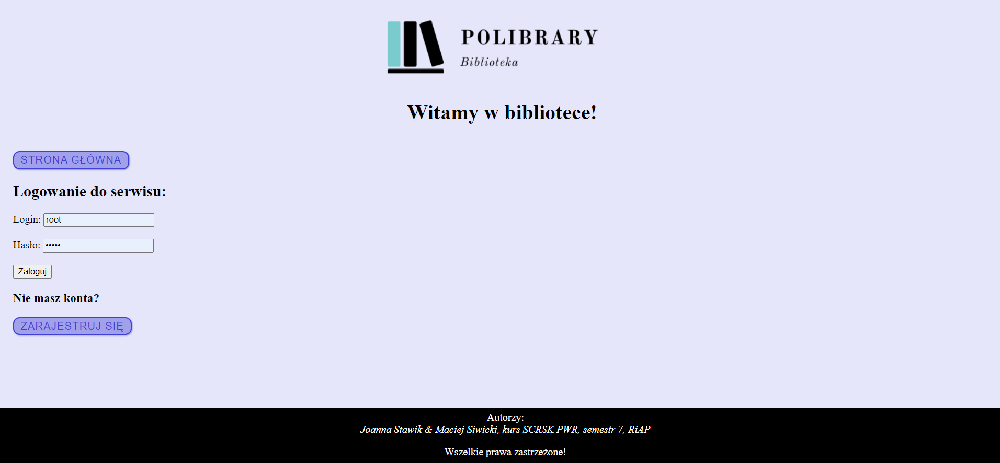
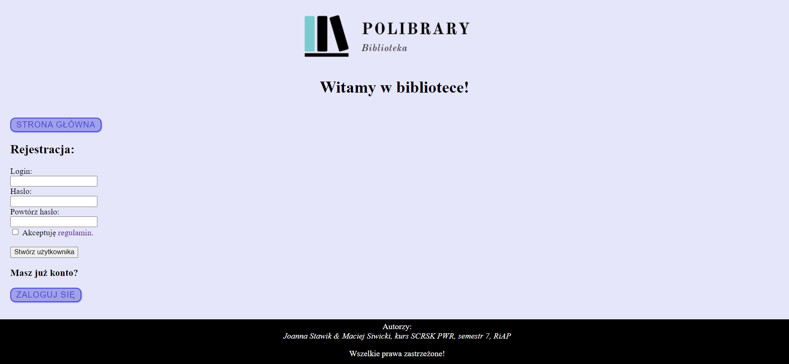
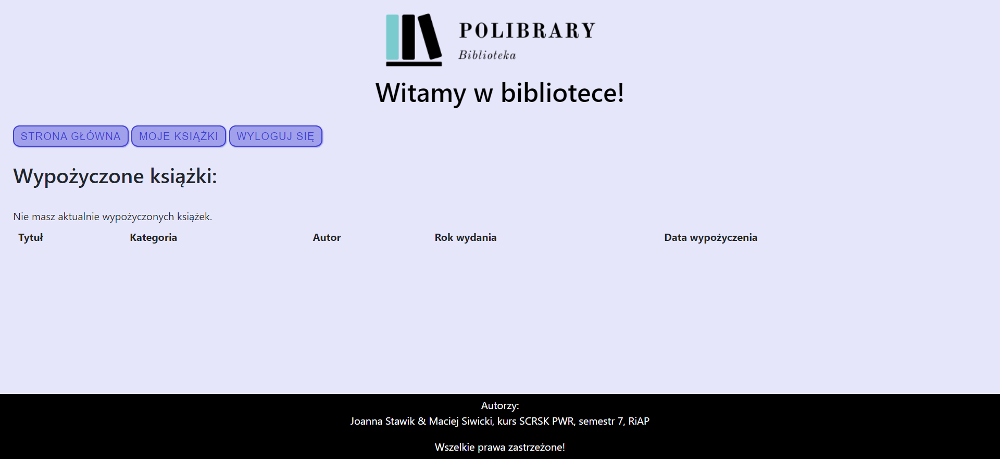
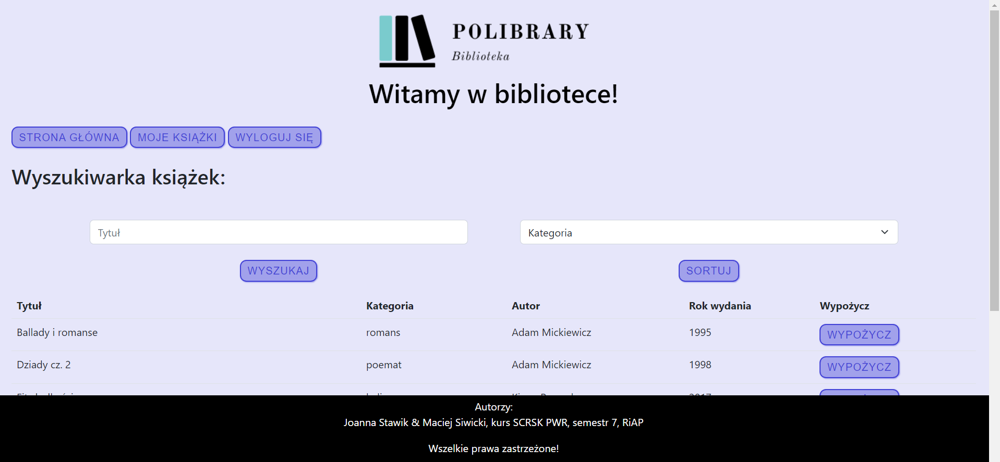

# Project-website-library---MySQL-PHP-CSS-HTML
> Project for class - Wroclaw University of Science and Technology

## Table of Contents
* [General Info](#general-information)
* [Technologies Used](#technologies-used)
* [Screenshots](#screenshots)
* [Setup](#setup)
* [Project Status](#project-status)
* [Acknowledgements](#acknowledgements)

## General Information
Library based on MySQL, where you can borrow books, search for them and sort. 
A user can be registered, after logging have his own account with deadlines to return books. 
An admin could lent books, add new books or delete them, and manage users.

## Technologies Used
- XAMPP
- MySQL
- PHP
- HTML/CSS.

## Screenshots
 
 
 
 

 
 

## Setup
Install XAMPP, open the XAMPP Control Panel, run Apache and MySQL. 
Then import the biblioteka.sql file to your MySQL database.
Add php1 folder to the path C:\xampp\htdocs
Next open the main file in Google Chrome (or other browser, but Chrome is recommended) and type http://localhost/php1/index.php

## Project Status
Project is: _no longer being worked on_.
Grade: 5.0

## Acknowledgements
I was working on this project with my friend - Maciej Siwicki. Many thanks to you Maciek!
